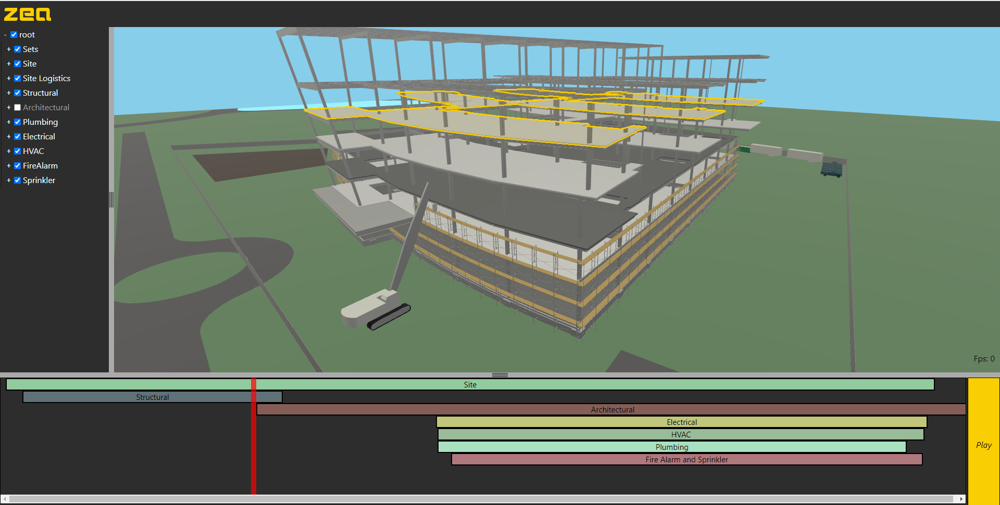

# 4D Schedule Viewer

This demos shows a large complex BIM model comprised of 7 IFC files loaded into the Zea Engine and controlled using a schedule.

## Loading the BIM data.

The IFC files were exported from Revit, and the 4D Bim information authored in Navisworks.

## Loading the BIM to Schedule bindings

To implement this demo, we reverse engineered the Navisworks Search Set rules so that we could load the exported NavisWorks search sets files directly and compute a binding to the BIM data. The SearchSets use logical queries to bind to various items within the model structure. Multiple rules are combined to isolate a selection of items which are then bound to the search set.

e.g.

1. Find all items in 'Structural'
2. Filter only those whose name contains 'Metal-Deck'
3. Filter only those that reside on level with name: 'Level 3'

## Loading the Schedule

the schedule was authored in Microsoft Project, and the .xslx file is loaded directly into the browse using sa JavaScript library. For each task in the schedule, a Navisworks search set is specified and the demo code binds each task to a search set.

The current time in the schedule is used to show, activate, deactivate tasks, which in turn show, highlight or hide the associated Search Set.

# Live Demo

http://docs.zea.live/4d-schedule-viewer/
